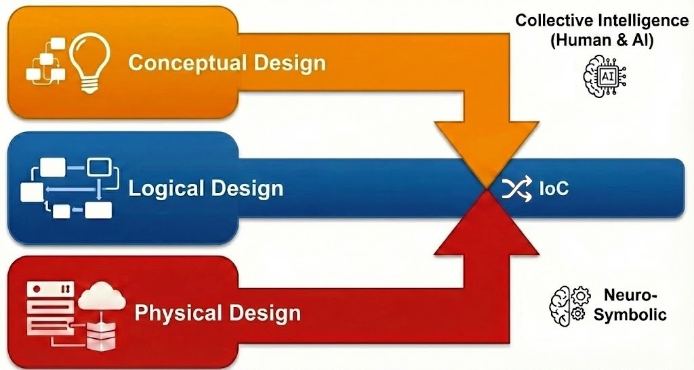
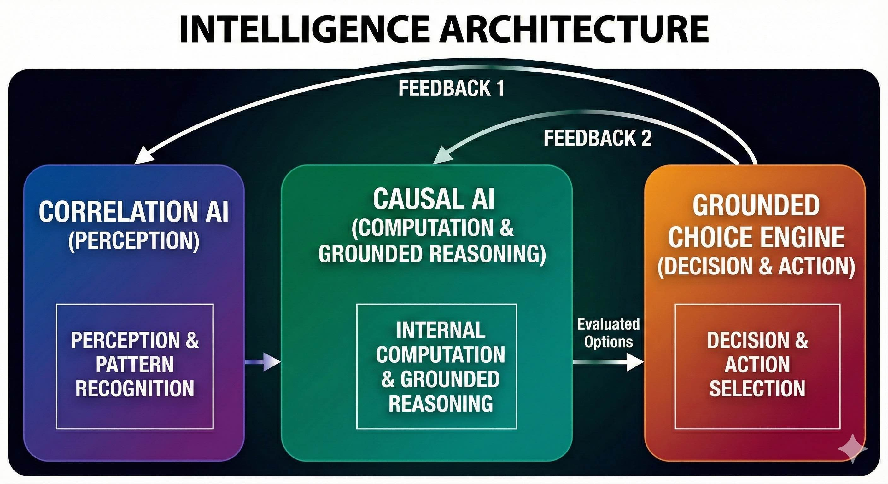

## Welcome to the first award-winning open-source company in MENA — and the world’s first inversion-of-control (causal AI) framework for generative AI

**Developers & supporters are always needed!**

🙋‍♀️ We’re building [BEAMJS](https://github.com/QuaNode/beamjs) — a generative AI **Inversion-of-Control (IoC)** and private **Internet-of-Behaviors (IoB)** framework.

🌈 Like things clean? Stick to static analysis and quality gates with [Codacy](https://docs.codacy.com/repositories/repository-dashboard/)

👩‍💻 Passionate about software architecture? This is for developers who know **DDD** and want to go next-level with [**Behavior-first**](https://github.com/QuaNode/backend-js/wiki/Behavior-first-design), **behavioral programming**, and **high-level declarative programming**.

🍿 If that sounds like you — you're already one of us.

🧙‍♂️ You can **learn**, **contribute**, and even **get paid** by joining the project. [👉 Follow us](https://github.com/quanode/beamjs/subscription) to get started.

## The Evolution: Trustful AI-First through Causal AI

From **software engineering** to **executable context engineering**. Here, "executable" no longer means writing code; it means writing conceptual context—without needing deep logical rules or rigid specs—and letting the system iterate alongside you.

- **Design-First:** Prioritizing behavioral and domain models over code or just specs.
- **AI-First:** Embedding AI natively to orchestrate and generate system behaviors dynamically.
- **Causal AI (IoC):** Advancing AI from correlational outputs to deterministic, logically-grounded cause-and-effect reasoning, underpinning robust **Internet-of-Behaviors (IoB)** ecosystems.
##

  

  

